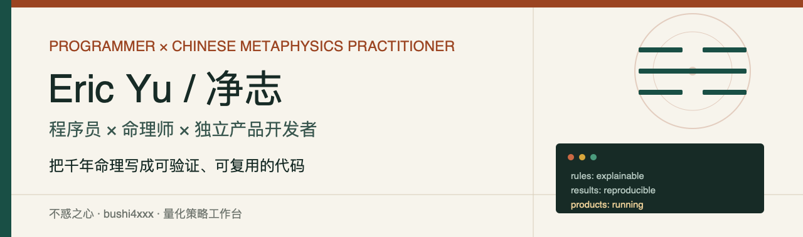

  

  <a href="https://www.buhuo.xin/#/">不惑之心</a> ·
  <a href="https://facai.stackbang.com/">量化策略工作台</a> ·
  <a href="https://gitee.com/stackbang">Gitee</a> ·
  <a href="https://www.buhuo.xin/#/">命理咨询</a>

## 你好，我是 Eric Yu / 净志

我是一名程序员，也是一名命理师。

过去六年，我持续把传统命理中的规则、知识与推演过程写成可验证、可复用的软件，并把它们做成真正有人使用的产品。我的工作横跨领域建模、多语言 SDK、AI 应用、全栈研发、数据策略与产品运营。

> 代码算，不猜。不编。

Most of my commercial products and core business systems are private. The public repositories here are the reusable foundations, engineering experiments, and open-source parts of that work.

## 我在做什么

| 项目 | 说明 | 入口 |
| --- | --- | --- |
| **不惑之心** | 传统文化与 AI 结合的命理产品。涵盖周易、六爻、梅花易数、八字、紫微斗数、合盘、运势与命理咨询 | [buhuo.xin](https://www.buhuo.xin/#/) |
| **卜筮 bushi** | 面向多端应用的六爻、梅花易数与 64 卦排盘内核，提供七种语言实现 | [查看开源库](#卜筮-bushi-开源生态) |
| **StockSniper** | 面向 A 股研究的策略执行、信号筛选、数据质量、回测与结果追踪系统 | [在线工作台](https://facai.stackbang.com/) · [社区版](https://github.com/EriconYu/stocksniper) |

## 核心能力

- **复杂领域建模**：把传统知识、判断规则与计算流程转化为结构化、可测试的代码。
- **跨语言基础设施**：维护 Go、Python、TypeScript、Dart、Java、Kotlin、Swift 多语言实现与一致性契约。
- **AI 产品化**：将确定性规则计算与 AI 解读分层，兼顾可解释性、体验与业务落地。
- **全栈与系统工程**：从算法、后端、Web、移动端、桌面端到部署、监控和持续迭代。
- **数据与策略系统**：多数据源回退、增量同步、质量校验、策略编排、回测与信号追踪。
- **商业系统建设**：多租户、API Key、权限、计费、支付、Webhook、审计、授权与私有部署。
- **产品经营**：会员、内容、咨询、用户增长与长期运营，而不只是完成一个 Demo。

## 私有产品沉淀

公开仓库只展示了我的一部分工作。长期维护的私有产品与商业系统，还覆盖以下方向：

- **命理专业工具**：历法、八字、紫微、星盘、命盘档案、运势与咨询工作台。
- **AI 内容生产**：ASR、翻译、TTS、音色克隆、图像/视频生成、提示词版本与多阶段工作流。
- **跨端应用**：Vue、Flutter、SwiftUI、UniApp、Electron、Wails、微信小程序与原生桌面端。
- **业务平台**：会员、计费、支付、授权、管理后台、运营数据和多端发布。
- **行业系统**：金融研究、电商定制、内容聚合，以及面向真实组织流程的业务系统。

我关注的不只是把功能写出来，而是定义边界、保护数据、控制成本、处理失败恢复，并让系统能够持续运行。

## 卜筮 bushi 开源生态

`bushi4xxx` 是一组面向不同技术栈的排盘引擎。它们共享相同的领域模型、坐标契约和标准回归案例，适合 Web、服务端、移动端与桌面应用集成。

| 语言 | 仓库 | 语言 | 仓库 |
| --- | --- | --- | --- |
| Go | [bushi4go](https://github.com/EriconYu/bushi4go) | Python | [bushi4python](https://github.com/EriconYu/bushi4python) |
| TypeScript | [bushi4ts](https://github.com/EriconYu/bushi4ts) | Dart / Flutter | [bushi4dart](https://github.com/EriconYu/bushi4dart) |
| Java | [bushi4java](https://github.com/EriconYu/bushi4java) | Kotlin | [bushi4kotlin](https://github.com/EriconYu/bushi4kotlin) |
| Swift | [bushi4swift](https://github.com/EriconYu/bushi4swift) |  |  |

当前公开能力包括：64 卦排盘、本卦/互卦/变卦、六爻纳甲、六亲、世应、伏藏、六神、时间/数字/随机/手摇起卦，以及统一的跨语言回归案例。

## 开源与商业

我相信真正有价值的开源，不是把所有业务代码公开，而是把可以复用、可以验证、能够促进协作的基础能力开放出来。

- 排盘算法与通用工程能力持续开源。
- 商业产品、私有数据、咨询体系与业务系统保持独立。
- 欢迎围绕传统文化计算、跨语言 SDK、AI 应用和产品工程展开合作。

## 技术栈

| 方向 | 技术 |
| --- | --- |
| 后端 | Go、Python / FastAPI、Java / Spring、REST / OpenAPI |
| Web | Vue、TypeScript、JavaScript、Vite、原生 Web |
| 客户端 | Flutter、SwiftUI、UniApp、Electron、Wails、微信小程序 |
| 数据与基础设施 | MySQL、SQLite、Redis、Docker、任务调度、审计与监控 |
| AI 与媒体 | LLM API、ASR、TTS、FFmpeg、图像与视频生成工作流 |

## 找到我

- GitHub: [@EriconYu](https://github.com/EriconYu)
- Gitee: [@stackbang](https://gitee.com/stackbang)
- 不惑之心: [www.buhuo.xin](https://www.buhuo.xin/#/)
- 量化策略工作台: [facai.stackbang.com](https://facai.stackbang.com/)

命理相关内容用于传统文化研究与个人探索；量化策略内容仅供研究，不构成投资建议。
